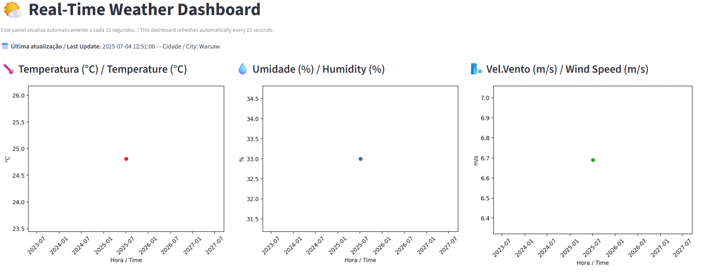

# 🌤️ Real-Time Weather Data Pipeline with Streamlit

This project demonstrates a **full mini data engineering pipeline**: real-time data ingestion, transformation, automation, and a responsive dashboard — all running in the cloud!  
**Weather data is collected every minute via GitHub Actions**, processed and displayed live on a professional Streamlit dashboard.

---

## 🚀 Overview

| Step            | Tool/Language            | Description                             |
| --------------- | ------------------------ | --------------------------------------- |
| Data Collection | Python + OpenWeather API | Pulls real-time weather data via HTTP   |
| Automation      | GitHub Actions           | Collects/transforms data every minute   |
| Storage         | JSON / CSV               | Saves raw and clean data files          |
| Transformation  | pandas                   | Normalizes and extracts fields          |
| Visualization   | Streamlit + Matplotlib   | Interactive dashboard and metrics       |

---

## 📦 File Structure

```bash
weather-data-pipeline/
├── weather_collector.py          # Collects and stores weather JSON data
├── transform_weather.py          # Transforms and cleans the data to CSV
├── dashboard.py                  # Streamlit app for live dashboard
├── .streamlit/
│   └── config.toml               # Forces wide mode for dashboard
├── data/
│   ├── raw_weather_*.json        # Raw weather data from API
│   └── clean_weather.csv         # Cleaned weather log for analysis
├── .github/workflows/
│   └── update_weather.yml        # GitHub Actions workflow for automation
└── weather_snapshot_bars.png     # Snapshot of chart output

```

---

🧪 How to Run It
* Option 1: Try the Live Cloud Dashboard
* No setup required!

👉 Live Streamlit Dashboard ((https://weather-data-pipeline-jhggjdheke6dnvfs8huxac.streamlit.app/))

---

## 📊 Preview

---

## 🌍 Technology Stack

* Python 3.11+
* requests
* pandas
* matplotlib
* Streamlit
* GitHub Actions (for data collection automation)

---

⚙️ How the Automation Works
* Data is collected every minute using GitHub Actions (no need for your computer to be on).

* Each new reading is appended to the CSV and the dashboard is always up to date.

* .streamlit/config.toml ensures the dashboard uses the full page width (wide layout).

---

## 💡 Why this project?

This simulates IoT-like sensor collection using public APIs — ideal for:

* Practicing real-time ingestion and processing

* Creating dashboards for reporting and monitoring

* Demonstrating automation (via GitHub Actions) for Data Engineering

* Simulating embedded devices/data pipelines with zero cost

---

## 📌 Author

**Daniel Hernandes Gomes**
🔗 [LinkedIn](https://www.linkedin.com/in/daniel-hernandes-gomes-9b87b77a/)

Feel free to fork or reuse for your own pipelines!

---

*This project was built as part of my transition into Data Engineering and showcases skills in data ingestion, transformation, and visualization.*