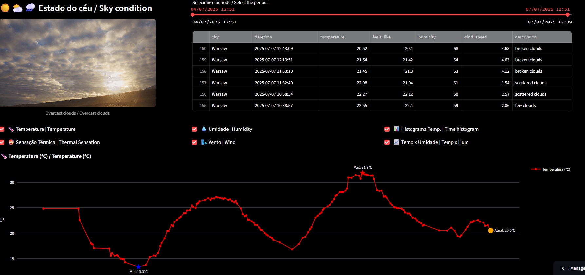

# 🌤️ Real-Time Weather Data Pipeline with Streamlit

This project demonstrates a **full mini data engineering pipeline**: real-time data ingestion, transformation, automation, and a responsive dashboard — all running in the cloud!  
**Weather data is collected every minute via GitHub Actions**, processed and displayed live on a professional Streamlit dashboard.

---

## 🚀 Overview

| Step            | Tool/Language            | Description                             |
| --------------- | ------------------------ | --------------------------------------- |
| Data Collection | Python + OpenWeather API | Pulls real-time weather data via HTTP   |
| Automation      | GitHub Actions           | Collects/transforms data every minute   |
| Storage         | JSON / CSV               | Saves raw and clean data files          |
| Transformation  | pandas                   | Normalizes and extracts fields          |
| Visualization   | Streamlit + Plotly       | Interactive dashboard and metrics       |

---

## 📦 File Structure

```bash
weather-data-pipeline/
├── weather_collector.py          # Collects and stores weather JSON data
├── transform_weather.py          # Transforms and cleans the data to CSV
├── dashboard.py                  # Streamlit app for live dashboard (with Plotly)
├── .streamlit/
│   └── config.toml               # Forces wide mode for dashboard
├── data/
│   ├── raw_weather_*.json        # Raw weather data from API
│   └── clean_weather.csv         # Cleaned weather log for analysis
├── .github/workflows/
│   └── update_weather.yml        # GitHub Actions workflow for automation
└── weather_snapshot_bars.png     # Snapshot of chart output
```

---

## 🧪 How to Run It

### Option 1: Try the **Live Cloud Dashboard**
- No setup required — just click:
- 👉 [Live Streamlit Dashboard](https://weather-data-pipeline-jhggjdheke6dnvfs8huxac.streamlit.app/)

### Option 2: Run Locally (manual)

1. **Step 1: Collect Data**
    ```bash
    python weather_collector.py
    ```
    - Pulls the current weather from OpenWeatherMap and saves it as `/data/raw_weather_<timestamp>.json`.

2. **Step 2: Transform the Data**
    ```bash
    python transform_weather.py
    ```
    - Extracts fields like temperature, humidity, wind, and stores them in `clean_weather.csv`.

3. **Step 3: Run the Dashboard**
    ```bash
    streamlit run dashboard.py
    ```
    - Your browser will open a live dashboard with real-time metrics and charts (wide mode enabled).

---

## 📊 Preview



---

## 🌍 Technology Stack

- Python 3.11+
- requests
- pandas
- plotly
- Streamlit
- GitHub Actions (for data collection automation)

---

## ⚙️ How the Automation Works

- **Data is collected every minute using GitHub Actions** (your computer doesn’t need to be on).
- Each new reading is appended to the CSV, keeping the dashboard always up to date.
- `.streamlit/config.toml` ensures the dashboard uses the full page width (wide layout).
- All source code is versioned and workflows are fully transparent.

---

## 💡 Why this project?

This simulates IoT-like sensor collection using public APIs — ideal for:

- Practicing real-time data ingestion and processing
- Creating dashboards for reporting and monitoring
- Demonstrating automation (via GitHub Actions) for Data Engineering
- Simulating embedded devices/data pipelines with zero cost

---

## 📌 Author

**Daniel Hernandes Gomes**  
🔗 [LinkedIn](https://www.linkedin.com/in/daniel-hernandes-gomes-9b87b77a/)

Feel free to fork or reuse for your own pipelines!

---

*This project was built as part of my transition into Data Engineering and showcases skills in data ingestion, transformation, and visualization.*
